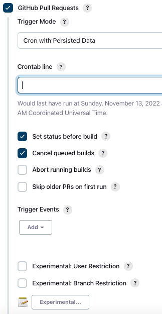

# Jenkins CI Demo

## What is Jenkins?
Jenkins is an automation tool. Specifically Jenkins is intended to facilitate Continuous Integration and Continuous Delivery (CI/CD).

### What is meant by Continuous Integration (CI)?
Think of CI as being a set of pre-merge validations of the code we write. Under normal circumstances whenever we want to merge our source code into a target branch we open a pull request (PR) or merge request if using gitlab. Jenkins can be used to perfrom those pre-merge validations. Below are some examples of pre-merge validations.

- regression tests
- code coverage
- code quality checking (i.e. linting, security scans)
- others ...

### What is meant by Continuous Delivery (CD)?
Think of CD as delivery concerns to be automated after the code we write has satisfied all pre-merge conditions applied during CI in addition to peer code review.

CD might entail:
- publishing of build artifacts to registries
- deployment of applications to target environments (i.e. dev, staging, prod, ...)
- others ...

## Running Jenkins locally
See documentation on how to run a local jenkins server [here](https://github.com/jenkinsci/docker/blob/master/README.md).

### Starting up a local image
Assuming you have docke installed run the following:

```
docker run -p 8080:8080 -p 50000:50000 --restart=on-failure -v jenkins_home:/var/jenkins_home jenkins/jenkins:lts-jdk11
```

This will start a local jenkins build server. Once it's started navigate to 

http://localhost:8080

and follow setup instructions.

## Creating a CI pipeline
In order to create a genuine CI build we need to have a means of automating a response to PR creation and change. We can take one of two approaches.

### Webhook triggering
We can touch on this approach at a later date. This approach requires elevated grants within github. That is you must be either a repo admin or an organization maintainer in order to create github webhook. Given that we may not always have elevated grants let's start with polling.

### Polling
Install the [GitHub Integration Plugin](https://plugins.jenkins.io/github-pullrequest/)

Once installed we'll get additional pr triggering behaviors.


Adding a crontab expression similar to the following will poll at a ninterval of 5 minutes.

```
H/5 * * * *
```

Specify `Trigger Events` of `Pull Request Opened` and `Commit changed`

This will allow your build to trigger based on the opening or change of a pull request against your build's configured `Branches to build` branch specifier.
